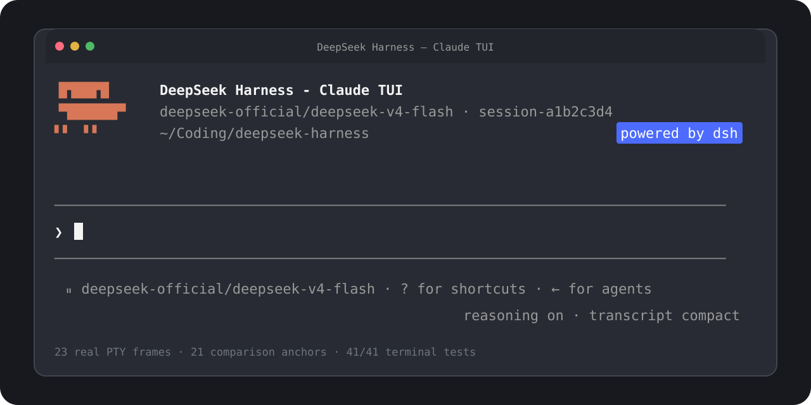

<h1 align="center">DeepSeek Harness — Claude TUI</h1>

<p align="center"><strong>Claude Code muscle memory. DeepSeek Harness underneath.</strong></p>

<p align="center">English · <a href="./README.zh-CN.md">简体中文</a></p>

<p align="center">
  An unofficial, high-fidelity Claude Code-style terminal interface for DeepSeek Harness,<br />
  reconstructed from real PTY captures and verified cell by cell.
</p>

<p align="center">
  <a href="https://github.com/cogine-ai/dsh-claude-tui/stargazers"></a>
  <a href="https://github.com/cogine-ai/dsh-claude-tui/actions/workflows/ci.yml"></a>
  <a href="./LICENSE"></a>
  
  
</p>

<p align="center">
  
</p>

> [!NOTE]
> This is an independent community project. It is not affiliated with, endorsed by, or sponsored by Anthropic or DeepSeek. “Claude Code” identifies the version-pinned compatibility target; no Anthropic source code is included. See the [trademark and compatibility notice](./DISCLAIMER.md).

## Why this exists

DeepSeek Harness has a composable Agent, Session, tool, approval, question, and subagent runtime. Claude Code has a terminal workflow many developers already know by muscle memory.

This plugin joins those two ideas without forking Harness core:

- **Feels familiar:** Claude-shaped shell, prompt, menus, transcript, approvals, questions, and agent states.
- **Runs on Harness:** live Harness models, durable Sessions, commands, permissions, tools, and subagents.
- **Proves fidelity:** 23 frames captured from a real Claude Code `2.1.227` PTY; 21 are automated comparison anchors.
- **Tests the terminal, not a mockup:** buffer choice, cell geometry, RGB styles, hardware cursor, and interaction transitions.

It is an external Harness bundle—not a web skin and not a hardcoded terminal recording.

## Try it

Prerequisites: a working DeepSeek Harness CLI, Node.js `24`, and pnpm `11`.

```bash
git clone https://github.com/cogine-ai/dsh-claude-tui.git
cd dsh-claude-tui

corepack pnpm install --frozen-lockfile
corepack pnpm check

dsh plugin --profile claude-tui add "$PWD"
DSH_TOOLS_MODE=code dsh --profile claude-tui
```

Sending a real model request requires the credentials for the Harness model provider you select.

## What already works

| Surface | Implemented behavior |
| --- | --- |
| Main shell | normal-buffer scrollback, Claude orange logo, responsive header, editor, status footer |
| Prompt | multiline editing, submit/steer, cancellation, reverse history search |
| Completion | slash commands and bounded `@` workspace file mentions |
| Transcript | user, assistant, reasoning, tool call/result, usage, request and turn outcomes |
| Protocols | real Harness approval and structured-question providers |
| Agents | foreground/background subagent states, expandable output, active-agent roster |
| Sessions | create, exact-id resume, interactive picker, graceful flush and terminal restoration |

Useful controls:

| Key | Action |
| --- | --- |
| `Enter` | submit while idle or steer a running Agent |
| `Shift+Enter` | insert a newline |
| `Esc` / `Ctrl+C` | interrupt a running turn |
| `Ctrl+R` | search prompt history |
| `Ctrl+O` | expand or compact tool details |
| `Left Arrow` | hide or show the active-agent roster |
| `Ctrl+D` | press twice on an empty prompt to exit cleanly |

## Fidelity

Verified against Claude Code `2.1.227` in a true-color xterm-compatible PTY:

- **23** reference frames and **21** automated visual/semantic anchors.
- **41/41** terminal tests at `80x24` and `100x30`.
- Real Harness runs for approvals, questions, and foreground/background subagents.
- One intentional difference: a blank top row prevents logo clipping.

[Full qualification report](./docs/visual-qualification-2.1.227.md)

## Architecture

```text
@deepseek-ai/dsh-base
  → dsh-claude-tui bundle
    → startup argument service
    → worker-thread code runtime
    → one terminal-owned root Agent
      → durable Session event projection
      → pi-tui normal-buffer renderer
      → approval + question protocol adapters
      → subagent lifecycle + active-run roster
```

The plugin waits for Loader settlement, binds every event to the exact root Agent, delegates unknown slash commands to Harness, and reverses registrations before restoring raw terminal state.

## Compatibility

Targets the observed Claude Code `2.1.227` TUI only. Harness remains the source of truth for runtime data and capabilities; unsupported Claude-only states are not simulated. New versions require requalification.

## Development

```bash
corepack pnpm install --frozen-lockfile
corepack pnpm check
```

The check gate runs TypeScript no-emit validation, all Vitest terminal tests, and the production build.

To refresh the reference corpus with the locally installed Claude Code `2.1.227` executable:

```bash
corepack pnpm capture:claude-reference -- --cwd /path/to/a/trusted/workspace
```

Dynamic capture scenarios use an isolated Claude config, a dummy key, and a loopback-only Anthropic mock. They make no external model request and do not require a user API key.

## Roadmap

**Now — v0.1.0 Release Hardening**

- ship a publishable package from a clean checkout;
- make `npx dsh-claude-tui` the complete install-and-launch path;
- qualify first-run setup, repeat-run idempotence, and packed-tarball execution.

The milestone and its release gates are tracked in the [v0.1.0 Release Hardening plan](./docs/release-hardening-v0.1.0.md).

**Next — after v0.1.0**

- richer attachment and completion surfaces;
- broader session management and rename flows;
- additional plan, todo, and background-job states;
- more terminal emulators and operating-system qualification.

Issues and focused pull requests are welcome. Visual-parity changes should include an independently captured reference or an explicit, documented Harness-semantic boundary.

## License

Original project code is available under the [MIT License](./LICENSE). Product names and marks remain the property of their respective owners; the MIT License does not grant rights to third-party trademarks.
