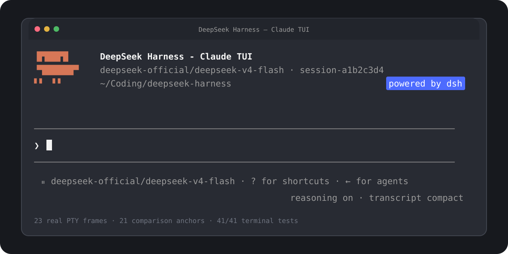

<h1 align="center">DSH Claude TUI</h1>

<p align="center"><strong>A Claude Code-style terminal workflow, powered by DeepSeek Harness.</strong></p>

<p align="center">English · <a href="./README.zh-CN.md">简体中文</a></p>

<p align="center">
  Start in one command. Use real DSH models, Sessions, tools, approvals, and subagents<br />
  through a familiar, high-fidelity terminal interface.
</p>

<p align="center">
  <a href="https://github.com/cogine-ai/dsh-claude-tui/stargazers"></a>
  <a href="https://github.com/cogine-ai/dsh-claude-tui/actions/workflows/ci.yml"></a>
  <a href="https://www.npmjs.com/package/dsh-claude-tui"></a>
  <a href="./LICENSE"></a>
  
  
</p>

<p align="center">
  
</p>

> [!NOTE]
> This is an independent community project. It is not affiliated with, endorsed by, or sponsored by Anthropic or DeepSeek. “Claude Code” identifies the version-pinned interaction target; no Anthropic source code is included. See the [trademark and compatibility notice](./DISCLAIMER.md).

## Start in one command

Requires Node.js `22.19+` or `24+`.

```bash
npx --yes --legacy-peer-deps dsh-claude-tui
```

That command installs and opens the TUI selected by npm's `latest` tag. You do not need a global `dsh`, a repository checkout, pnpm, or manual profile setup. To pin the current published release exactly, add `@0.1.6` to the package name.

The `legacy-peer-deps` flag avoids npm's expensive resolution of unused upstream Web UI peers. It skips peer-conflict enforcement; this release explicitly includes the required TUI services and pins its DSH dependencies. The installed-package gate checks the complete `npm ls --all` tree and rejects missing, invalid, or conflicting dependencies. Plain `npx dsh-claude-tui` is also qualified with ordinary npm peer resolution, though a cold installation can take several minutes. The flag does not change the DSH runtime version or TUI behavior.

A real model request needs credentials for the DSH provider you select. Use `/provider` to inspect or enter credentials and `/model` (or `Option+P` / `Alt+P`) to switch among the models and effort levels exposed by DSH.

For repeat use:

```bash
npm install --global --legacy-peer-deps dsh-claude-tui@0.1.6
dshtui
```

The global install exposes both `dshtui` and the canonical `dsh-claude-tui` command. Resume work with `dshtui --resume` for the Session picker, or `--resume <session-id>` for an exact Session.

## DSH 0.1.5-rc.2 support (unreleased)

The `0.1.7` source candidate pins Harness to `0.1.5-rc.2`. External runtimes must satisfy `>=0.1.5-rc.2 <0.1.6` and pass the behavioral probe. Published TUI `0.1.6` still uses DSH `0.1.2-rc.1`; the npm commands above install that published version, not this candidate.

- Live replies use Agent assistant-stream events; completed replies, usage, and timing replay from V3 Session settlements. Retry drafts are removed without duplicating committed text.
- Model selection receives the explicit Agent during setup. Command images use the current typed attachment envelope, and the profile uses `personaPrefix`.
- The Claude Code `2.1.227` reference layout, colors, keyboard controls, approvals, questions, image composer, plan toggle, and Session picker are retained.
- On macOS, skill updates use a one-second polling interval to avoid native file-watcher shutdown hangs while preserving live discovery.
- PTC keeps the `0.1.5` worker-thread runtime. This candidate does not import the incompatible `0.1.6-alpha` PTC or plugin-lifecycle changes.
- The production dependency graph and [official bilingual documentation mirror](./docs/upstream/dsh/README.md) follow the same exact release. The mirror contains 1,412 original files and is excluded from npm packages.

Run this candidate from its checkout:

```bash
corepack pnpm install --frozen-lockfile
corepack pnpm build
DSH_HOME=/tmp/dsh-claude-tui-0.1.5-rc.2 DSH_CLAUDE_TUI_RUNTIME=bundled node lib/cli.js
```

> [!WARNING]
> DSH now stores V3 Sessions. Supported older logs migrate to new files while preserving the originals; upgraded Sessions cannot be read by older Harness versions. Use separate Homes for cross-version testing. The optional SQLite Session backend was removed in `0.1.2`; export those older Sessions with their original runtime first. SQLite query/index storage is a separate service.

See the [official 0.1.5 change summary](https://github.com/deepseek-ai/deepseek-harness/releases/tag/dsh-v0.1.5-rc.1), [rc.2 notes](https://github.com/deepseek-ai/deepseek-harness/releases/tag/dsh-v0.1.5-rc.2), and [adaptation record](./docs/harness-0.1.5-rc.2-adaptation.md). Upstream Web file upload, preview, and sidebar features do not imply corresponding TUI interfaces.

## What you get

| Area | User-facing behavior |
| --- | --- |
| Familiar terminal | Claude-shaped welcome panel, prompt, menus, transcript, status rows, approvals, questions, and Agent states |
| Real Harness runtime | DSH-owned models, durable Sessions, commands, approval policies, tools, structured questions, and subagents |
| Live model setup | Provider/model catalog, advertised effort levels, saved defaults, masked API-key entry, and credential-source visibility |
| Productive prompting | Multiline editing, image paste, submit or steer, cancellation, history search, slash completion, and bounded `@` file mentions |
| Clear execution | Reasoning and tool activity, compact/expanded results, cache hit rate, token totals, TTFT, throughput, and turn outcome |
| Session and Agent flow | New or resumed Sessions, graceful flush, foreground/background subagents, and an active-agent roster |
| Verified runtime identity | Welcome panel shows the actual TUI/Harness version, bundled or system runtime, DSH Home, and tool mode |

The TUI reads capabilities from DSH rather than hardcoding model, effort, credential, or approval behavior. Harness remains the source of truth; Claude-only cloud services, account state, model behavior, and private permission semantics are not simulated.

## Everyday controls

| Key or command | Action |
| --- | --- |
| `Enter` | Submit while idle or steer a running Agent |
| `Shift+Enter` | Insert a newline |
| `Ctrl+V` | Paste a clipboard image; on macOS, `Command+V` remains text paste |
| `Backspace` | Remove the last pending image when the text composer is empty |
| `Shift+Tab` | Toggle DSH plan mode for the current Session |
| `Esc` / `Ctrl+C` | Interrupt the active turn |
| `Ctrl+R` | Search prompt history |
| `Ctrl+O` | Expand or compact tool details |
| `Option+P` / `Alt+P` or `/model` | Open the live DSH model picker |
| `/provider` | Inspect or update DSH provider credentials |
| `Left Arrow` | Hide or show the active-agent roster |
| `Ctrl+D` | Press twice on an empty prompt to exit cleanly |

Run `/help` inside the TUI for the current command list.

## Works with an existing DSH setup

The default launcher removes the need to choose an installation strategy up front:

1. Reuse a compatible DSH already associated with the selected `$DSH_HOME`, or a verifiable `dsh` on `PATH`.
2. Probe it in an isolated, credential-free temporary Home.
3. Fall back to the bundled, shrinkwrap-pinned DSH `0.1.5-rc.2` when no external runtime qualifies.

Compatibility requires both the version range `>=0.1.5-rc.2 <0.1.6` and a successful behavioral probe. When a Home can be shared safely, existing credentials, Sessions, settings, and unrelated profiles remain available. The launcher does not overwrite an unowned profile. An unsafe implicit default can fall back to `~/.dsh-claude-tui` with a visible notice; an explicit `DSH_HOME` conflict fails with an actionable error instead of silently moving data.

| Variable | Behavior |
| --- | --- |
| `DSH_CLAUDE_TUI_RUNTIME=auto` | Default: try compatible system DSH, then bundled DSH |
| `DSH_CLAUDE_TUI_RUNTIME=system` | Require a compatible external DSH |
| `DSH_CLAUDE_TUI_RUNTIME=bundled` | Always use the packaged DSH |
| `DSH_HOME=/path` | Use an explicit DSH data Home |
| `DSH_TOOLS_MODE=native\|ptc\|both` | DSH tool presentation shown as Standard, PTC, or Both |

See [Launcher environment compatibility](./docs/launcher-environment-compatibility.md) for the complete selection, ownership, and recovery contract.

## Compatibility and verification

The main interaction target is the observed Claude Code `2.1.227` TUI; the `[Image #1]` Ctrl+V composer behavior was independently observed against Claude Code `2.1.237`. Current qualification covers:

- macOS arm64 and Linux x64;
- true-color, xterm-compatible terminals;
- **24** independently captured PTY reference frames and **22** automated visual/semantic anchors;
- Automated tests covering `80x24`, `100x30`, clipboard/attachment failure and cancellation paths, the attachment-aware command envelope and live profile probe, packed-tarball installation, macOS `Shift+Tab` through a real PTY, both command names, Session resume, approvals, questions, and foreground/background subagents. An additional opt-in macOS system-clipboard gate sends an installed-package image through DSH storage and a local Files API/chat mock.

The Windows launcher, junction, signal-forwarding, VT-input, dependency-prebuild, and STA image-clipboard paths are implemented, and the pinned DSH upstream has a native Windows gate. This TUI's own CI still runs only on Ubuntu, however, and no Windows packed-TUI/ConPTY UAT has been recorded. Windows is therefore an implemented but currently unqualified target, not a supported release platform. Read the [full visual and semantic qualification report](./docs/visual-qualification-2.1.227.md) or the [artifact-hardening baseline](./docs/release-hardening-v0.1.0.md).

## Build it with us

This project should be more than a theme layered over a runtime. The goal is a fast, inspectable terminal client that respects DSH semantics and gives developers a great place to improve the Harness experience together.

You do not need to know the entire runtime to contribute. Useful entry points include:

| Contribution lane | A good first contribution |
| --- | --- |
| Terminal qualification | Reproduce a layout or keybinding issue in a named terminal, OS, and geometry |
| Runtime integration | Add a focused test for one DSH command, Session, approval, or subagent boundary |
| Interaction design | Improve image composition, richer references, completion, or Session management without hiding unsupported states |
| Reliability | Reduce startup ambiguity, strengthen packed-install coverage, or turn a field failure into a deterministic fixture |
| Docs and language | Improve setup guidance, explain an architecture boundary, or keep English and Chinese docs in sync |
| Accessibility | Improve color fallback, keyboard-only flow, screen-reader output, or narrow-terminal behavior |

Start with the [contribution guide](./CONTRIBUTING.md), then open a [focused issue](https://github.com/cogine-ai/dsh-claude-tui/issues/new/choose) or pull request. For a larger change, propose the user problem and evidence first so maintainers and contributors can shape the seam together.

## Develop locally

```bash
corepack pnpm install --frozen-lockfile
corepack pnpm check
```

The release gate runs TypeScript validation, a clean production build, then the complete serial Vitest suite. Visual-parity changes must include an independently captured reference or a documented Harness-semantic boundary. Runtime changes must prove the installed package path, not only source imports.

Near-term opportunities include richer image composition, file and Session reference completion, broader Session management, more plan/todo/background-job states, and qualification across more terminals and operating systems. These are contribution directions, not claims about shipped behavior.

## License

Original project code is available under the [MIT License](./LICENSE). Product names and marks remain the property of their respective owners; the MIT License does not grant rights to third-party trademarks.
